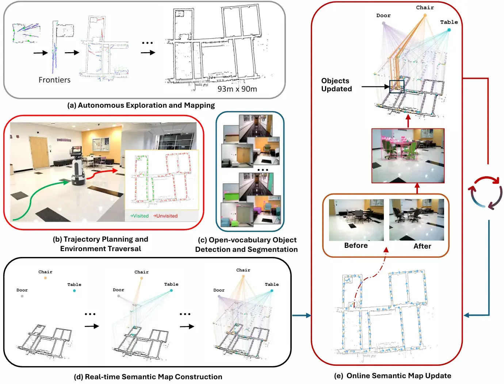
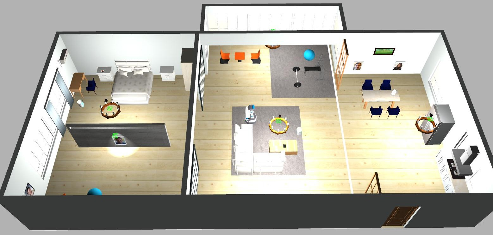

<h1 align="center" style="font-size: 1.8em; font-weight: bold;">
  Autonomous Exploration and Semantic Updating of Large-Scale Indoor Environments with Mobile Robots​​
</h1>

<p align="center">
  <a href="https://saihaneeshallu.github.io/">Sai Haneesh Allu</a>, 
  <a href="https://www.linkedin.com/in/itay-kadosh-695718239/">Itay Kadosh</a>, 
  <a href="https://personal.utdallas.edu/~tyler.summers/">Tyler Summers</a>, 
  <a href="https://yuxng.github.io">Yu Xiang</a>
</p>

<div align="center"">

[arXiv](https://arxiv.org/abs/2409.15493)  **|** [Project WebPage](https://irvlutd.github.io/SemanticMapping/)  **|** [Video](https://youtu.be/q3bfSFYbX08)

</div>

<br/>

<!--  -->
<div align="justify">
We introduce a new robotic system that enables a mobile robot to autonomously explore an unknown
environment, build a semantic map of the environment,
and subsequently update the semantic map to reflect
environment changes, such as location changes of objects.
Our system leverages a LiDAR scanner for 2D occupancy
grid mapping and an RGB-D camera for object perception.
We introduce a semantic map representation that combines
a 2D occupancy grid map for geometry, with a topological
map for object semantics. This map representation enables
us to effectively update the semantics by deleting or adding
nodes to the topological map. Our system has been tested
on a Fetch robot. The robot semantically mapped a
93m×90m floor and updated the semantic map once objects
are moved in the environment.
</div>

<br/>
<br/>

<p align="center">
  
</p>

<br/>


# Index

1. [Installation](#installation)
2. [Initialization](#initialization)
3. [Mapping and Exploration](#mapping-and-exploration)
4. [Environment Traversal planning](#environment-traversal-planning)
5. [Semantic Map Construction and Update](#semantic-map-construction-and-update)
6. [Real World Demo](#real-world-demo)

<br/>
<br/>


# Installation
The following subsections provides detailed installation guidelines related to workspace setup, dependencies and other requirements to test this work effectively. 

## A.  Install ROS and Gazebo
This code is tested on ros noetic version. Detailed installation instructions are found [here](http://wiki.ros.org/noetic/Installation/Ubuntu).To install ROS Noetic, execute the following commands in your terminal:
```
sudo sh -c 'echo "deb http://packages.ros.org/ros/ubuntu $(lsb_release -sc) main" > /etc/apt/sources.list.d/ros-latest.list'

sudo apt install -y curl

curl -s https://raw.githubusercontent.com/ros/rosdistro/master/ros.asc | sudo apt-key add -

sudo apt update

sudo apt install -y ros-noetic-desktop-full

echo "source /opt/ros/noetic/setup.bash" >> ~/.bashrc

source ~/.bashrc
```
For compatibility with ROS Noetic, Gazebo 11 is recommended. Detailed installation instructions are found [here](https://classic.gazebosim.org/tutorials?tut=install_ubuntu&cat=install#Defaultinstallation:one-liner).

```
sudo sh -c 'echo "deb http://packages.osrfoundation.org/gazebo/ubuntu-stable `lsb_release -cs` main" > /etc/apt/sources.list.d/gazebo-stable.list'

wget https://packages.osrfoundation.org/gazebo.key -O - | sudo apt-key add -

sudo apt-get update

sudo apt-get install -y gazebo11
```
## B. Create Conda Environment
We strongly recommend using a virtual environment for this work, preferably Anaconda or Miniconda. Create a new environment as follows:
```
conda create -n sem-map python==3.9
conda activate sem-map
```

## C. Install dependencies
This script will install the ROS dependencies required for this work.
```
./install_ros_dependencies.sh
```
Next, install the python modules required.
```
pip install -r requirements.txt
```

## D. Compiling workspace
Compile and source the ROS workspace using the following commands:
```
cd fetch_ws
catkin_make
source devel/setup.bash
```

> If the compilation doesn't conisder python3 by default, compile with the following command. Make sure to use correct python path.
```
catkin_make -DPYTHON_EXECUTABLE=/usr/bin/python3
source devel/setp.bash
```

## E. Install Robokit
Please refer to the instructions [here](robokit/README.md) to install the robokit module. Robokit is a stand alone module for running object detection and segmentation. It is not related to the ROS workspace here. Therefore, ***do not source the ROS workspace during installation or while running Robokit***. 

<br/>

**NOTE:** *Make sure to activate the conda environment and source the workspace in each terminal. (do not source the workspace for robokit)* 


```
conda activate sem-map
source fetch_ws/devel/setup.bash
```

<br/>
<br/>
<br/>

# Initialization
This section covers the steps to start the simulation environment and spawn the robot in the scene. Run the following commands, each in a separate terminal. You should be able to see the fetch robot spawned in the environment. 
## Launch environment and spawn the robot
```
roslaunch aws_robomaker_small_house_world small_house.launch gui:=true
roslaunch fetch_gazebo spawn_robot.launch
```
Once the robot is spawned, run the following scripts to tuck the arm and set it's head position. 

```
cd fetch_ws/src/fetch_gazebo/fetch_gazebo/
python tuck_arm.py
python set_head.py
```
Once the initialization is done successfully, you should see the following scene.

<p align="center">
  
</p>
<br/>
<br/>
<br/>

# Mapping and Exploration
Once system has been initialized, we proceed to explore and map the environment, while also recording robot's camera pose and base_link pose. To achieve this, follow the steps below in this sequence. 

Run rviz to visualize next steps.
```
cd fetch_ws
rosrun rviz rviz -d experiment.rviz
```
## A. Mapping

Starts the GMapping ROS node. 
```
roslaunch fetch_navigation fetch_mapping.launch
```
## B. Record robot trajectory
This script first creates a data-folder of format <Year-month-date_Hour-Minute-Seconds>/pose. Then saves the data points in pose folder, in .npz format. Specify the time-interval between consecutive data points as the argument.
```
cd scripts
python save_data.py <time-interval>
```
## C. Exploration
This command launches the exploration node. When the exploration ends, it saves  ***map.pgm*** and ***map.yaml*** files in the user's HOME directory. 
```
roslaunch explore_lite explore_n_save.launch
```

https://github.com/user-attachments/assets/cf0d4105-ab1b-430b-87c4-44465b01f557

<br/>
<br/>
<br/>

# Environment Traversal planning
This section describes how to plan the robot's traversal through the environment.
```
cd scripts
```

## A. Extract the robot exploration trajectory points
From the saved data-folder at the end of exploration, first get the recorded robot poses. These poses will be saved by default in ***robot_trajectory.json*** file.
```
python extract_robot_trajectory.py <data-folder>
```
## B. Generate traversal trajectory - Travelling Salesman Problem 
Next, sample the poses and plan the sequence to visit the sampled points at low cost, using a Traveling Salesman Problem fomrulation.  
```
python tsp_surveillance_trajectory.py robot_trajectory.json
```
This saves the sequence of sampled points as ***surveillance_traj.npz*** .

<br/>
<br/>
<br/>

# Semantic Map Construction and Update
To construct or update the semantic map, the robot first needs to localize itself in the built map and traverse the environment to see the things. For this, either move the robot to initial position (x=0, y=0, yaw=0) in gazebo or delete the robot in gazebo and spawn it again ( make sure to tuck and set the head pose). 

## A. Localization
Launch the localization module while specifying the saved *map.yaml* file path.

```
roslaunch fetch navigation fetch_localize.launch map_file:=<absolute-path-of-map.yaml>
```
In another termianl publish the initial pose of the robot. This helps the localization moduls to have better initial estimate. 
```
rosrun fetch_navigation pub_initial_pose.py
```

## B. Construction
To construct the semantic map, start the object detection and segmentation module, and perform object association while traversing the environment. Run the following scripts simultaneously in two terminals to construct the semnantic map while traversing the environment.  
```
cd robokit
python semantic_map_construction.py
```

```
cd scripts
python navigate.py
```
Once the traversal is completed, close the scripts and the semantic map is stored as ***graph.json***


https://github.com/user-attachments/assets/6fb81b0b-8309-4a54-b3d9-acc76b27f575


## C. Update
Similar to construction phase, run the following scripts simultaneously in two terminals to update the semantic map while traversing the environment.  You may delete, add or relocate objects in the gazebo environment. 
```
cd robokit
python semantic_map_update.py
```

```
cd scripts
python navigate.py
```
Once the traversal is completed, close the scripts and the updated semantic map is stored as ***graph_updated.json***


<br/>
<br/>
<br/>
<br/>

# Real World Demo
These videos showcase brief clips of experiments demonstrating autonomous exploration and mapping, and semantic map construction in a large indoor environment measuring 96m x 93m. click to view the vidoes. 


<table>
  <tr>
    <td align="center">
      <a href="https://www.youtube.com/watch?v=yVzF-y6eULY">
        
      </a>
      <p>Video 1: Explorationand Mapping</p>
    </td>
    <td align="center">
      <a href="https://www.youtube.com/watch?v=h-wM1g0Hk6g">
        
      </a>
      <p>Video 2: Semantic Map construction</p>
    </td>
  </tr>
</table>


# Citation
Please cite this work if it helps in your research
```
@inproceedings{allu2024semanticmapping,
      title={Autonomous Exploration and Semantic Updating of Large-Scale Indoor Environments with Mobile Robots},
      author={Allu, Sai Haneesh and Kadosh, Itay and Summers, Tyler and Xiang, Yu},
      journal={arXiv preprint arXiv:2409.15493},
      year={2024}
    }
```
