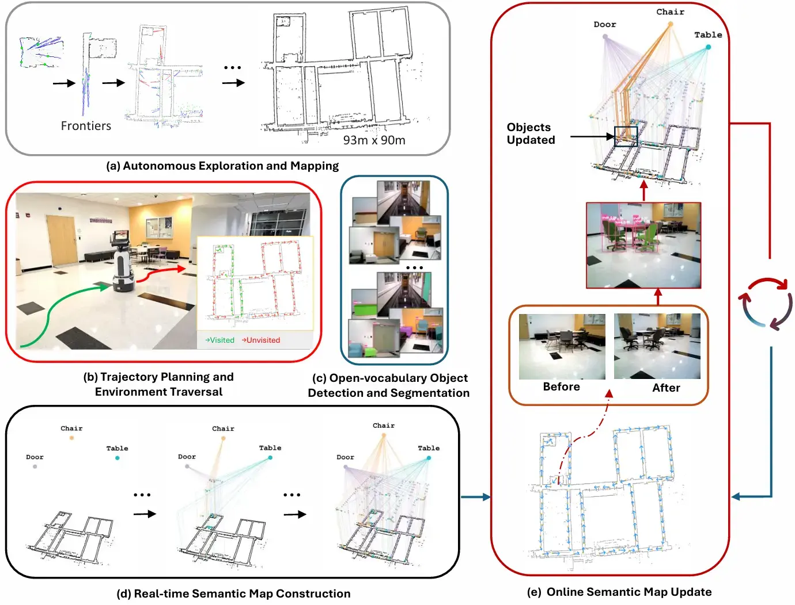
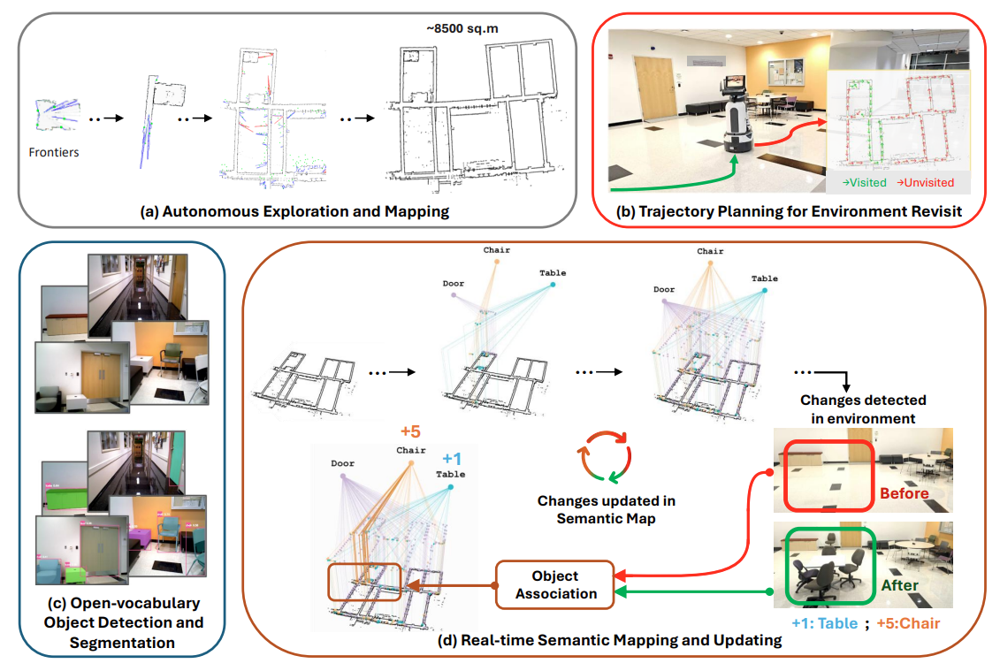
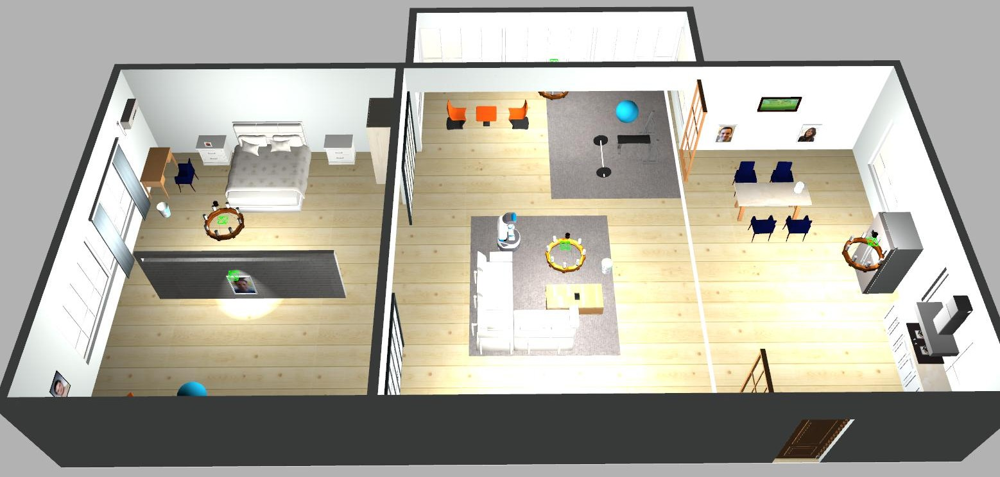

<h1 align="center" style="font-size: 1.4em; font-weight: bold;">
Build Once, Monitor Continuously: Persistent Semantic Mapping via Autonomous Exploration and Open-Vocabulary Object Updates</h1>

<p align="center">
  <a href="https://saihaneeshallu.github.io/">Sai Haneesh Allu</a>, 
  <a href="https://www.linkedin.com/in/itay-kadosh-695718239/">Itay Kadosh</a>, 
  <a href="https://personal.utdallas.edu/~tyler.summers/">Tyler Summers</a>, 
  <a href="https://yuxng.github.io">Yu Xiang</a>
</p>

<div align="center"">

[arXiv](https://arxiv.org/abs/2409.15493)  **|** [Project WebPage](https://irvlutd.github.io/SemanticMapping/)  **|** [Video](https://www.youtube.com/watch?v=z_Ch6kSjYvc)

</div>

<br/>

<!--  -->
<div align="justify">
Persistent semantic monitoring of indoor spaces such as warehouses, hospitals, and offices requires a robot to repeatedly monitor an environment and track how objects change over time. Running full simultaneous localization and mapping (SLAM) with dense semantic reconstruction from scratch on every visit is redundant when the environment geometry stays the same and only the objects move. We present a modular two-stage system that separates geometric mapping from semantic updating. In the first stage, a frontier-based exploration method with a dynamic search window builds a 2D occupancy grid. In the second stage, the robot relocalizes in this map and builds a semantic object graph using an open-vocabulary object detector and a promptable segmentation model. Only the lightweight semantic stage is repeated on later visits, so the system scales well to frequent revisits. The object graph uses a category and distance based association rule to update objects, which lets the map reflect both intra-session changes (object changes within a single traversal) and inter-session changes (changes across revisits), such as objects being moved, removed, or added. We validate the system on a Fetch robot in two real indoor environments of about 8,500 sq.m and 117 sq.m, and report precision, recall, and F1 scores across multiple update iterations.
</div>

<br/>
<br/>

<p align="center">
  
</p>

<br/>

# Citation
Please cite this work if it helps in your research
```
@misc{allu2026buildoncemonitorcontinuously,
      title={Build Once, Monitor Continuously: Persistent Semantic Mapping via Autonomous Exploration and Open-Vocabulary Object Updates}, 
      author={Sai Haneesh Allu and Itay Kadosh and Tyler Summers and Yu Xiang},
      year={2026},
      eprint={2409.15493},
      archivePrefix={arXiv},
      primaryClass={cs.RO},
      url={https://arxiv.org/abs/2409.15493}, 
}
```

For any questions regarding this work, contact [Sai Haneesh Allu](https://saihaneeshallu.github.io/). For any issues regarding this code, please raise an [issue](https://github.com/IRVLUTD/AutoX-SemMap/issues).

# Index

1. [Installation](#installation)
2. [Initialization](#initialization)
3. [Mapping and Exploration](#mapping-and-exploration)
4. [Environment Traversal planning](#environment-traversal-planning)
5. [Semantic Map Construction and Update](#semantic-map-construction-and-update)
6. [Running on a real robot system](#running-on-a-real-robot-system)
7. [Real World Demo](#real-world-demo)

<br/>
<br/>


# Installation
The following subsections provide detailed installation guidelines related to workspace setup, dependencies and other requirements to test this work effectively. 
Additionally, a docker has been provided with instructions. Credits to [Iminolee](https://github.com/iminolee).
## A.  Install ROS and Gazebo
This code is tested on ros noetic version. Detailed installation instructions are found [here](http://wiki.ros.org/noetic/Installation/Ubuntu). To install ROS Noetic, execute the following commands in your terminal:
```
sudo sh -c 'echo "deb http://packages.ros.org/ros/ubuntu $(lsb_release -sc) main" > /etc/apt/sources.list.d/ros-latest.list'

sudo apt install -y curl

curl -s https://raw.githubusercontent.com/ros/rosdistro/master/ros.asc | sudo apt-key add -

sudo apt update

sudo apt install -y ros-noetic-desktop-full

echo "source /opt/ros/noetic/setup.bash" >> ~/.bashrc

source ~/.bashrc
```
For compatibility with ROS Noetic, Gazebo 11 is recommended. Detailed installation instructions are found [here](https://classic.gazebosim.org/tutorials?tut=install_ubuntu&cat=install#Defaultinstallation:one-liner).

```
sudo sh -c 'echo "deb http://packages.osrfoundation.org/gazebo/ubuntu-stable `lsb_release -cs` main" > /etc/apt/sources.list.d/gazebo-stable.list'

wget https://packages.osrfoundation.org/gazebo.key -O - | sudo apt-key add -

sudo apt-get update

sudo apt-get install -y gazebo11
```
## B. Create Conda Environment
We strongly recommend using a virtual environment for this work, preferably Anaconda or Miniconda. Create a new environment as follows:
```
conda create -n sem-map python==3.9
conda activate sem-map
```
## C. Clone the repository
```
git clone https://github.com/IRVLUTD/AutoX-SemMap.git
cd AutoX-SemMap
```

## D. Install dependencies
This script will install the ROS dependencies required for this work.
```
./install_ros_dependencies.sh
```
Next, install the python modules required.
```
pip install -r requirements.txt
```

## E. Compiling workspace
Compile and source the ROS workspace using the following commands:
```
cd fetch_ws
catkin_make
source devel/setup.bash
```

> If the compilation doesn't consider python3 by default, compile with the following command. Make sure to use correct python path.
```
catkin_make -DPYTHON_EXECUTABLE=/usr/bin/python3
source devel/setup.bash
```

## F. Install Robokit
Please refer to the instructions [here](robokit/README.md) to install the robokit module. Robokit is a stand alone module for running object detection and segmentation. It is not related to the ROS workspace here. Therefore, ***do not source the ROS workspace during installation or while running Robokit***. 

<br/>

**NOTE:** *Make sure to activate the conda environment and source the workspace in each terminal. (do not source the workspace for robokit)* 


```
conda activate sem-map
cd AutoX-SemMap
source fetch_ws/devel/setup.bash
```

<br/>
<br/>
<br/>

# Initialization
This section covers the steps to start the simulation environment and spawn the robot in the scene. Run the following commands, each in a separate terminal. You should be able to see the fetch robot spawned in the environment. 
## Launch environment and spawn the robot
```
roslaunch aws_robomaker_small_house_world small_house.launch gui:=true
roslaunch fetch_gazebo spawn_robot.launch
```
Once the robot is spawned, run the following scripts to tuck the arm and set it's head position. 

```
cd AutoX-SemMap/fetch_ws/src/fetch_gazebo/fetch_gazebo/scripts
python tuck_arm.py
python set_head.py
```
Once the initialization is done successfully, you should see the following scene.

<p align="center">
  
</p>
<br/>
<br/>
<br/>

# Mapping and Exploration
Once system has been initialized, we proceed to explore and map the environment, while also recording robot's camera pose and base_link pose. To achieve this, follow the steps below in this sequence. 

Run rviz to visualize next steps.
```
cd AutoX-SemMap/fetch_ws
rosrun rviz rviz -d experiment.rviz
```
## A. Mapping

Starts the GMapping ROS node. 
```
roslaunch fetch_navigation fetch_mapping.launch
```
## B. Record robot trajectory
This script first creates a data-folder of format <Year-month-date_Hour-Minute-Seconds>/pose. Then saves the data points in pose folder, in .npz format. Specify the time-interval (in seconds) between consecutive data points as the argument. You may set the time interval to be 1 as a nominal value. 
```
cd AutoX-SemMap/scripts
python save_data.py <time-interval>
```
## C. Exploration
This command launches the exploration node. When the exploration ends, it saves  ***map.pgm*** and ***map.yaml*** files in the user's HOME directory. 
```
roslaunch explore_lite explore_n_save.launch
```

https://github.com/user-attachments/assets/cf0d4105-ab1b-430b-87c4-44465b01f557

<br/>
<br/>
<br/>

# Environment Traversal planning
This section describes how to plan the robot's traversal through the environment. When the map has been built, robot does not need to explore the environment again. So from the explored trajectory, we compute a low cost trajectory ( sequence of points) for the robot to visit the entire environment.  Copy the ***map.pgm*** and ***map.yaml*** files saved after exploration from the home directory into the ***scripts*** directory. Update the image path in ***map.yaml*** to point to the copied ***map.pgm***.
```
cd AutoX-SemMap/scripts
```

## A. Extract the robot exploration trajectory points
From the saved data-folder at the end of exploration, first get the recorded robot poses. These poses will be saved by default in ***robot_trajectory.json*** file.
```
python extract_robot_trajectory.py <data-folder>
```
## B. Generate traversal trajectory - Travelling Salesman Problem 
Next, sample the poses and plan the sequence to visit the sampled points at low cost, using a Traveling Salesman Problem formulation.  
```
python tsp_surveillance_trajectory.py robot_trajectory.json
```
This saves the sequence of sampled points as ***surveillance_traj.npz*** and also displays the sequence as shown below. 


https://github.com/user-attachments/assets/10d6edcd-1a69-45dc-8038-68448d104e47


<br/>
<br/>
<br/>

# Semantic Map Construction and Update
To construct or update the semantic map, the robot first needs to localize itself in the built map and traverse the environment to observe the objects. For this, either move the robot to initial position (x=0, y=0, yaw=0) in gazebo or delete the robot in gazebo and spawn it again ( make sure to tuck and set the head pose). 

## A. Localization
Launch the localization module while specifying the saved *map.yaml* file path.

```
roslaunch fetch_navigation fetch_localize.launch map_file:=<absolute-path-of-map.yaml>
```
In another terminal publish the initial pose of the robot. This helps the localization module to have a better initial estimate. 
```
rosrun fetch_navigation pub_initial_pose.py
```

## B. Construction
To construct the semantic map, start the object detection and segmentation module, and perform object association while traversing the environment. Run the following scripts simultaneously in two terminals to construct the semantic map while traversing the environment.  
```
cd AutoX-SemMap/robokit
python semantic_map_construction.py
```

```
cd AutoX-SemMap/scripts
python navigate.py
```
Once the traversal is completed, close the scripts and the semantic map is stored as ***graph.json***


https://github.com/user-attachments/assets/6fb81b0b-8309-4a54-b3d9-acc76b27f575


## C. Update
Similar to construction phase, run the following scripts simultaneously in two terminals to update the semantic map while traversing the environment.  You may delete, add or relocate objects in the gazebo environment. 
```
cd AutoX-SemMap/robokit
python semantic_map_update.py
```

```
cd AutoX-SemMap/scripts
python navigate.py
```
Once the traversal is completed, close the scripts and the updated semantic map is stored as ***graph_updated.json***


<br/>
<br/>
<br/>


# Running on a real robot system
## A. Running on a Fetch robot

Since the Fetch robot doesn't have a GPU, we assume you have a remote system connected to Fetch robot via WiFi or Ethernet connection. You can use this repository as it is and follow the instructions to install it on your remote system. You can skip the installation of gazebo and the initialization section as you have the actual robot. Other than that you can run the sections [Mapping and Exploration](#mapping-and-exploration) ,  [Environment Traversal planning](#environment-traversal-planning) ,  [Semantic Map Construction and Update](#semantic-map-construction-and-update)  as described. 


## B. Running on any other robot

We assume that either your robot has a GPU or you use a remote system with GPU and connect to robot, and have your ros workspace containing mapping and localization packages. Assuming you have the workspace named **_"catkin_ws"_**. 
  1.  Follow steps mentioned in Installation -  [B](#b-create-conda-environment), [C](#c-clone-the-repository), [D](#d-install-dependencies), [F](#f-install-robokit) sections.

  2. Clone the exploration package in your workspace and compile your workspace
     ```
     cd catkin_ws/src
     git clone https://github.com/IRVLUTD/dynamic-window-frontier-exploration.git 
     ```
     Compile your workspace.

  2. Next, to run mapping and exploration, follow steps mentioned in [Mapping and Exploration](#mapping-and-exploration) (skip section A in it and run your mapping module).
  3. Next, follow the instructions in [Environment Traversal planning](#environment-traversal-planning), to generate the traversal trajectory.
  4. Finally, to construct the semantic map and also perform the update step, follow the instructions in [Semantic Map Construction and Update](#semantic-map-construction-and-update) ( skip section A in this and run your localization module). 

<br/>
<br/>
<br/>

# Real World Demo
These videos showcase brief clips of experiments demonstrating autonomous exploration and mapping, and semantic map construction in a large indoor environment measuring 96m x 93m. Click to view the videos. 


<table>
  <tr>
    <td align="center">
      <a href="https://www.youtube.com/watch?v=yVzF-y6eULY">
        
      </a>
      <p>Video 1: Exploration and Mapping</p>
    </td>
    <td align="center">
      <a href="https://www.youtube.com/watch?v=h-wM1g0Hk6g">
        
      </a>
      <p>Video 2: Semantic Map construction</p>
    </td>
  </tr>
</table>


# Acknowledgement
This work was supported by the DARPA Perceptually-enabled Task Guidance (PTG) Program under contract number HR00112220005, the Sony Research Award Program, the National Science Foundation (NSF) under Grant Nos. 2346528 and 2520553 and the NVIDIA Academic Grant Program Award. The work of T. Summers was supported by the United States Air Force Office of Scientific Research under Grant FA9550-23-1-0424 and the National Science Foundation under Grant ECCS-2047040. We would like to thank our colleague, [Jishnu Jaykumar P](https://jishnujayakumar.github.io/), for his assistance during the experiments.

