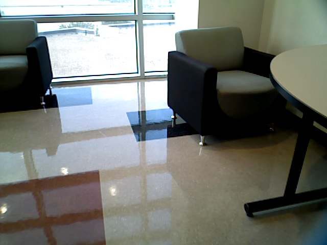
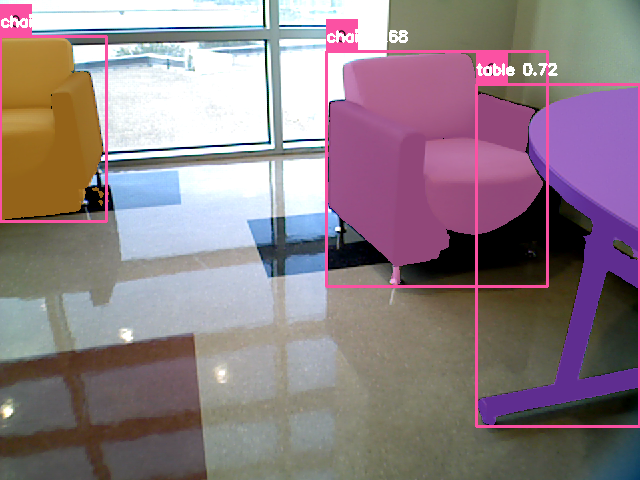

# RoboKit
A toolkit for robotic tasks. This toolkit is compiled by [Jishnu Jaykumar P](https://jishnujayakumar.github.io/).

## Features
- Zero-shot classification using OpenAI CLIP.
- Zero-shot text-to-bbox approach for object detection using GroundingDINO.
- Zero-shot bbox-to-mask approach for object detection using SegmentAnything (MobileSAM).
- Zero-shot image-to-depth approach for depth estimation using Depth Anything.
- Zero-shot feature upsampling using FeatUp.

## Getting Started

### Prerequisites
- Python 3.9
- torch (tested 2.0)
- torchvision

### Installation
Before installing, set the CUDA_HOME path. Make sure to replace your cuda path below.
```
export CUDA_HOME=/use/local/cuda
```
```sh
pip install -r requirements.txt
conda install pytorch torchvision torchaudio pytorch-cuda=11.8 -c pytorch -c nvidia
python setup.py install
```

Note: Check GroundingDINO [installation](https://github.com/IDEA-Research/GroundingDINO?tab=readme-ov-file#hammer_and_wrench-install) for the following error
```sh
NameError: name '_C' is not defined
```

## Usage
- Note: All test scripts are located in the [`test`](test) directory. Place the respective test scripts in the root directory to run.
- SAM: [`test_sam.py`](test/test_sam.py)
- GroundingDINO + SAM: [`test_gdino_sam.py`](test/test_gdino_sam.py)
- GroundingDINO + SAM + CLIP: [`test_gdino_sam_clip.py`](test/test_gdino_sam_clip.py)
- Depth Anything: [`test_depth_anything.py`](test/test_depth_anything.py)
- FeatUp: [`test_featup.py`](test/test_featup.py)
- Test Datasets: [`test_dataset.py`](test/test_dataset.py)
  - `python test_dataset.py --gpu 0 --dataset <ocid_object_test/osd_object_test>`

## Sample output of GroundingDINO + SAM
<table>
  <tr>
    <td align="center">
      <a href="https://www.youtube.com/watch?v=yVzF-y6eULY">
        
      </a>
      <p>Input Image</p>
    </td>
    <td align="center">
      <a href="https://www.youtube.com/watch?v=h-wM1g0Hk6g">
        
      </a>
      <p>Segmented Image</p>
    </td>
  </tr>
</table>

## Roadmap

Future goals for this project include: 
- Add a config to set the pretrained checkpoints dynamically
- More: TODO

## Acknowledgments

This project is based on the following repositories (license check mandatory):
- [CLIP](https://github.com/openai/CLIP)
- [MobileSAM](https://github.com/ChaoningZhang/MobileSAM)
- [GroundingDINO](https://github.com/IDEA-Research/GroundingDINO)
- [DepthAnything](https://huggingface.co/docs/transformers/main/en/model_doc/depth_anything#transformers.DepthAnythingForDepthEstimation)
- [FeatUp](https://github.com/mhamilton723/FeatUp)


## License
This project is licensed under the MIT License. However, before using this tool please check the respective works for specific licenses.
